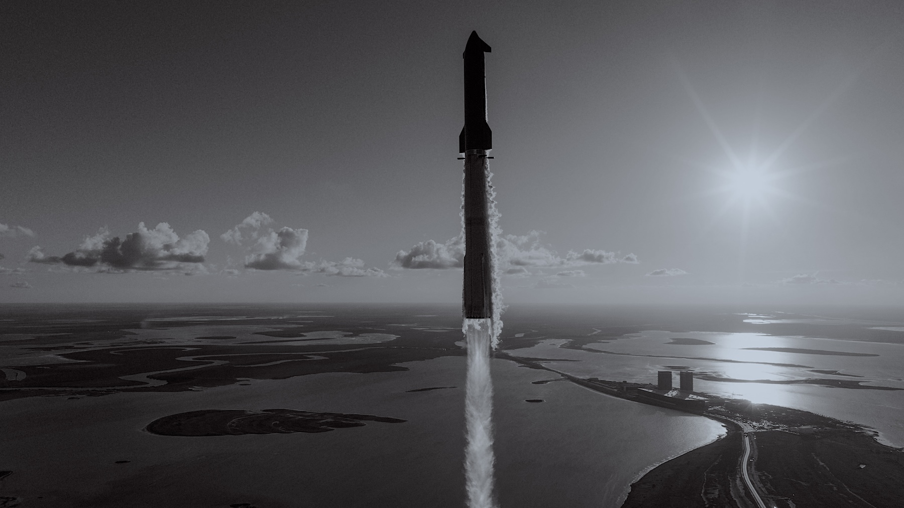

  

<h1 align=center>Martín Mengo</h1>

  

<h2>About Me</h2>

  <strong>Systems Engineer</strong> from <a href="https://utn.edu.ar/es/">Universidad Tecnológica Nacional</a>.
  Building flight software and embedded telemetry systems with <a href="https://github.com/nasa/fprime">NASA JPL's F´ (F Prime)</a>.

  Currently a Systems Engineer at <strong>OctaFlow</strong>, working across
  CI/CD, mobile infrastructure, and Python-based tooling.

  I believe in doing what is necessary to achieve a greater goal and help humanity expand the scale of consciousness.

